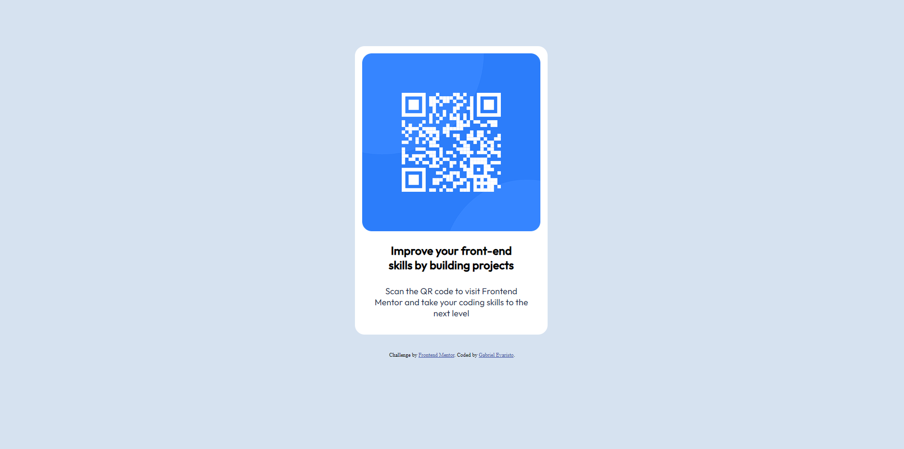

# Frontend Mentor - QR code component solution

This is a solution to the [QR code component challenge on Frontend Mentor](https://www.frontendmentor.io/challenges/qr-code-component-iux_sIO_H). Frontend Mentor challenges help you improve your coding skills by building realistic projects. 

## Table of contents

- [Overview](#overview)
  - [Screenshot](#screenshot)
  - [Links](#links)
- [My process](#my-process)
  - [Built with](#built-with)
  - [Continued development](#continued-development)
  - [Useful resources](#useful-resources)
- [Author](#author)

## Overview

### Full Page

### Links

- Solution URL: [Add solution URL here](https://your-solution-url.com)
- Live Site URL: [Add live site URL here](https://your-live-site-url.com)

## My process

### Built with

- Semantic HTML5 markup
- CSS custom properties
- Flexbox
- CSS Grid

### Continued development

This challenge provide me a perception of what I need to improve.
Exemple:
- Css Grid
- Flexbox
- UI

**Note: Delete this note and the content within this section and replace with your own plans for continued development.**

### Useful resources

- [W3Schools](https://www.w3schools.com/css/default.asp) - This helped me for XYZ reason. I really liked this pattern and will use it going forward.

## Author

- Frontend Mentor - [@Xoris650](https://www.frontendmentor.io/profile/Xoris650)
- Twitter - [@Ev4r1st00](https://twitter.com/Ev4r1st00)

